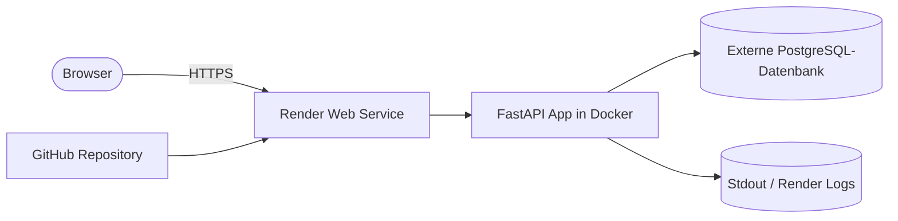

# C3 — Cloud Platform Deployment

Diese Anwendung ist ein kleines FastAPI-Backend mit CRUD-Funktionalität für Items. Sie läuft lokal per Docker und wird für die Abgabe auf Render als öffentliche Web-App betrieben.

## Was umgesetzt wurde

- FastAPI-Backend mit Root-Endpoint und CRUD für Items in [app/main.py](app/main.py)
- Persistente Speicherung über SQLAlchemy und eine externe PostgreSQL-Datenbank
- Docker-Setup für lokale Entwicklung in [Dockerfile](Dockerfile) und [docker-compose.yml](docker-compose.yml)
- Deployment-Konfiguration für Render in [render.yaml](render.yaml)
- Beispiel für benötigte Umgebungsvariablen in [.env.example](.env.example)
- Strukturierte JSON-Logs über Stdout in [app/main.py](app/main.py)

## Plattform-Wahl

Ich habe Render gewählt, weil die Plattform ein klares Git-Push-zu-Deploy-Setup bietet und das Projekt dort reproduzierbar über ein Blueprint-File eingerichtet werden kann. Für die Persistenz nutze ich eine externe PostgreSQL-Datenbank, deren Verbindungsdaten als Umgebungsvariable gesetzt werden.

## Architektur



## Relevante Konfiguration

### Umgebungsvariablen

Die Anwendung liest die Datenbank-URL aus `DATABASE_URL`. Lokal wird SQLite verwendet, auf Render verweist `DATABASE_URL` auf die externe PostgreSQL-Datenbank.

Beispiel aus [.env.example](.env.example):

```env
DATABASE_URL=sqlite:///./data/data.db
LOG_LEVEL=info
APP_NAME=C3-Template-App
```

### Render-Konfiguration

Die Datei [render.yaml](render.yaml) beschreibt den Web-Service, den Build- und Start-Befehl sowie die automatische Bereitstellung bei Push auf `main`.

### Persistenz

Die Daten überstehen Neustarts und neue Deployments über die externe PostgreSQL-Datenbank. Render selbst speichert die Anwendungsdaten nicht im Container.

## Setup-Anleitung

### Voraussetzungen

- GitHub-Repository mit dem Code
- Render-Account
- Externe PostgreSQL-Datenbank, zum Beispiel Neon oder Supabase
- Die Datenbank-Connection-URL als Secret/Env-Variable

### Lokal starten

```bash
docker compose up --build
```

Danach ist die API unter `http://localhost:8080` erreichbar, die Swagger-Oberfläche unter `http://localhost:8080/docs`.

### Render einrichten

1. Repository mit Render verbinden.
2. Blueprint aus [render.yaml](render.yaml) verwenden.
3. Die Umgebungsvariable `DATABASE_URL` als Secret setzen.
4. Eine externe PostgreSQL-Datenbank anlegen und deren Verbindungsstring eintragen.
5. Auto-Deploy aktiviert lassen.

### Automatisches Deployment

Nach dem Verknüpfen des Repositories reicht künftig ein Push auf `main`, damit Render automatisch neu deployed.

## Begründung der wichtigsten Entscheidungen

- Render statt Fly.io, weil der Fly-Workflow bei dir am Billing scheitert und Render hier einfacher reproduzierbar über GitHub angebunden werden kann.
- Externe PostgreSQL statt SQLite im Deployment, weil die Daten damit Neustarts und Deployments überstehen.
- Git-Push als Deployment-Auslöser, weil das den Ablauf für die Abgabe nachvollziehbar und reproduzierbar macht.

## Logging

Die App schreibt strukturierte JSON-Logs in Stdout. Diese sind im Render-Log-Interface sichtbar und enthalten unter anderem Methode, Pfad, Statuscode und Dauer eines Requests.

## Learnings

- Das eigentliche Deployment muss im Repository als Konfiguration sichtbar sein, nicht nur in einer Plattform-UI.
- Persistenz gehört in eine Datenbank oder ein Volume, nicht in den Container selbst.
- Ein Plattformwechsel ist sinnvoll, wenn die ursprünglich gewählte Plattform durch Billing oder Account-Einschränkungen blockiert.

## KI-Nutzung

Bei der Erstellung dieser Dokumentation und der Deployment-Vorlage wurden KI-Tools verwendet. Die erzeugten Teile wurden auf das Projekt angepasst und im Code sowie in der Konfiguration nachvollziehbar gemacht.

## Öffentliche URL

Nach dem Deployment wird die öffentliche URL hier eingetragen, zum Beispiel `https://<app-name>.onrender.com`.

