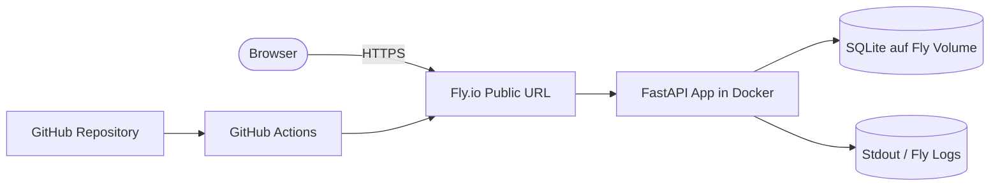

# C3 — Cloud Platform Deployment

Diese Anwendung ist ein kleines FastAPI-Backend mit CRUD-Funktionalität für Items. Sie wurde so vorbereitet, dass sie lokal per Docker läuft und auf Fly.io als öffentliche URL betrieben werden kann.

## Was umgesetzt wurde

- FastAPI-Backend mit Root-Endpoint und CRUD für Items in [app/main.py](app/main.py)
- Persistente Speicherung über SQLAlchemy und SQLite in einem Volume in [app/database.py](app/database.py)
- Docker-Setup für lokale Entwicklung in [Dockerfile](Dockerfile) und [docker-compose.yml](docker-compose.yml)
- Deployment-Konfiguration für Fly.io in [fly.toml](fly.toml)
- Automatisches Deployment per GitHub Actions in [.github/workflows/deploy.yml](.github/workflows/deploy.yml)
- Beispiel für benötigte Umgebungsvariablen in [.env.example](.env.example)
- Strukturierte JSON-Logs über Stdout in [app/main.py](app/main.py)

## Plattform-Wahl

Ich habe Fly.io gewählt, weil die Plattform für dieses Projekt einen klaren Weg von Git-Repository zu öffentlich erreichbarer URL bietet. Für den Auftrag ist wichtig, dass das Deployment reproduzierbar ist, Persistenz möglich ist und Deployments automatisiert ausgelöst werden können. Genau das deckt Fly.io mit Docker-Deploys, Volumes, Secrets und GitHub-Actions-Anbindung ab.

## Architektur



## Relevante Konfiguration

### Umgebungsvariablen

Die Anwendung liest die Datenbank-URL aus `DATABASE_URL`. Lokal wird SQLite verwendet, auf Fly.io zeigt die URL auf das gemountete Volume.

Beispiel aus [.env.example](.env.example):

```env
DATABASE_URL=sqlite:///./data/data.db
LOG_LEVEL=info
APP_NAME=C3-Template-App
```

### Fly.io-Konfiguration

Die Datei [fly.toml](fly.toml) beschreibt die App, den internen Port, das Volume und die Datenbank-URL. Das Volume sorgt dafür, dass die SQLite-Datei einen Redeploy übersteht.

### Deployment-Workflow

Der Workflow in [.github/workflows/deploy.yml](.github/workflows/deploy.yml) führt bei jedem Push auf `main` automatisch `flyctl deploy --remote-only` aus. Dafür wird nur der Secret `FLY_API_TOKEN` benötigt.

## Setup-Anleitung

### Voraussetzungen

- GitHub-Repository mit dem Code
- Fly.io-Account
- Fly-CLI (`flyctl`)
- GitHub Secret `FLY_API_TOKEN`

### Lokal starten

```bash
docker compose up --build
```

Danach ist die API unter `http://localhost:8080` erreichbar, die Swagger-Oberfläche unter `http://localhost:8080/docs`.

### Fly.io einrichten

```bash
flyctl auth login
flyctl launch --no-deploy
flyctl volumes create data --size 1 --region fra
flyctl secrets set DATABASE_URL="sqlite:////app/data/data.db"
flyctl deploy
```

### Automatisches Deployment

Nach dem ersten manuellen Setup reicht künftig ein Push auf `main`, damit GitHub Actions das neue Image auf Fly deployt.

## Begründung der wichtigsten Entscheidungen

- Fly.io statt nur Docker Compose, weil eine öffentliche URL, TLS, Volumes und Auto-Deploy in einer schlanken Konfiguration abgedeckt werden.
- SQLite statt externer Datenbank, weil die Persistenz über ein Fly-Volume für diese kleine Anwendung ausreichend ist und keine zusätzlichen Managed-DB-Kosten entstehen.
- GitHub Actions statt reiner Plattform-UI, weil das Deployment damit reproduzierbar und dokumentierbar ist.

## Logging

Die App schreibt strukturierte JSON-Logs in Stdout. Das ist für Fly.io direkt im Logging-Interface sichtbar und enthält unter anderem Methode, Pfad, Statuscode und Dauer eines Requests.

## Learnings

- Das eigentliche Deployment muss im Repository als Code sichtbar sein, nicht nur in einer Plattform-UI konfiguriert.
- Persistenz ist bei SQLite nur dann sinnvoll, wenn der Speicher sauber als Volume gemountet wird.
- Ein Auto-Deploy-Workflow ist für die Reproduzierbarkeit deutlich besser als ein manueller Klickpfad.

## KI-Nutzung

Bei der Erstellung dieser Dokumentation und der Deployment-Vorlage wurden KI-Tools verwendet. Die erzeugten Teile wurden auf das Projekt angepasst und im Code sowie in der Konfiguration nachvollziehbar gemacht.

## Öffentliche URL

Nach dem Deployment wird die öffentliche URL hier eingetragen, zum Beispiel `https://<app-name>.fly.dev`.

