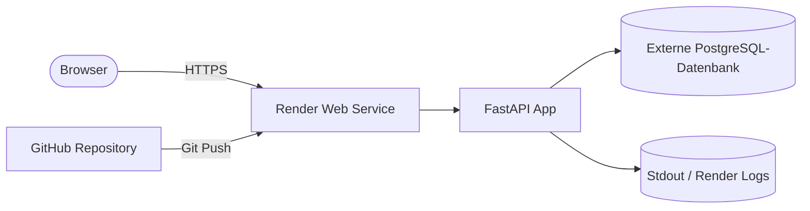

# C3 · Cloud-Plattform Deployment

Diese Anwendung ist ein kleines FastAPI-Backend mit CRUD-Funktionalität für Items. Lokal läuft sie per Docker Compose mit SQLite, produktiv ist sie als öffentliche Web-App auf Render erreichbar.

## Ergebnis

- Öffentliche URL: https://c3-template-app.onrender.com
- Plattform: Render
- Persistenter Datenspeicher: externe PostgreSQL-Datenbank
- Deployment-Methode: Git-Push mit Render Auto-Deploy
- Strukturierte Logs: JSON-Logs in Stdout, sichtbar im Render-Log-Interface

## Was umgesetzt wurde

- FastAPI-Backend mit Root-Endpoint und CRUD für Items in [app/main.py](app/main.py)
- Datenbankzugriff über SQLAlchemy in [app/database.py](app/database.py)
- Datenmodelle und Schemas in [app/models.py](app/models.py) und [app/schemas.py](app/schemas.py)
- Persistenz über eine externe PostgreSQL-Datenbank im Deployment
- Lokale Entwicklung mit Docker in [Dockerfile](Dockerfile) und [docker-compose.yml](docker-compose.yml)
- Reproduzierbare Deploy-Konfiguration für Render in [render.yaml](render.yaml)
- Beispielhafte Umgebungsvariablen in [.env.example](.env.example)
- Strukturierte JSON-Logs für Requests und wichtige Events in [app/main.py](app/main.py)

## Plattform-Wahl

Ich habe Render gewählt, weil die Plattform den Weg vom Repository zur öffentlichen Anwendung mit wenig Reibung abbildet: GitHub-Repository verbinden, Blueprint aktivieren, Secrets als Environment-Variablen setzen und dann per Git-Push automatisch deployen. Für diesen Auftrag ist das praktisch, weil die gesamte Konfiguration im Repository nachvollziehbar bleibt und nicht nur in einer Plattform-UI existiert.

Fly.io wurde im Verlauf verworfen, weil der Workflow hier durch Account- bzw. Billing-Einschränkungen blockiert war. Render war für die Abgabe robuster, weil sich die Anwendung dort mit einem stabilen Free-Tier und klarer Blueprint-Konfiguration betreiben liess.

## Architektur



## Relevante Konfiguration

### Umgebungsvariablen

Die Anwendung liest ihre Konfiguration über Environment-Variablen. Im Repository liegt dafür eine [.env.example](.env.example) als Vorlage.

| Variable | Zweck | Lokal | Render |
| --- | --- | --- | --- |
| `DATABASE_URL` | Verbindungsstring zur Datenbank | `sqlite:///./data/data.db` | PostgreSQL-URL als Secret |
| `LOG_LEVEL` | Log-Level der Anwendung | `info` | `info` |
| `APP_NAME` | Anzeigename der Anwendung | `C3-Template-App` | `C3-Template-App` |
| `PYTHON_VERSION` | Python-Runtime für Render | nicht nötig lokal | `3.11.11` |

### Render-Blueprint

Die Datei [render.yaml](render.yaml) beschreibt den Web-Service, den Build-Prozess und das automatische Deployment.

```yaml
services:
  - type: web
    name: c3-template-app
    runtime: python
    plan: free
    buildCommand: pip install -r requirements.txt
    startCommand: uvicorn app.main:app --host 0.0.0.0 --port $PORT
    autoDeploy: true
    envVars:
      - key: PYTHON_VERSION
        value: 3.11.11
      - key: DATABASE_URL
        sync: false
      - key: LOG_LEVEL
        value: info
      - key: APP_NAME
        value: C3-Template-App
```

Wichtig ist hier `sync: false` bei `DATABASE_URL`: Render erwartet den Wert beim Erstellen bzw. in den Service-Settings, statt ihn im Repository abzulegen.

### Lokale Entwicklung

Lokal nutzt die Anwendung SQLite über das Volume in Docker Compose. Das erlaubt schnelle Tests ohne externe Datenbank.

```env
DATABASE_URL=sqlite:///./data/data.db
LOG_LEVEL=info
APP_NAME=C3-Template-App
```

## Setup-Anleitung

### Voraussetzungen

- GitHub-Repository mit dem Projektcode
- Render-Account
- Externe PostgreSQL-Datenbank, zum Beispiel Neon oder Supabase
- Der Datenbank-Connection-String als Secret
- Optional für die lokale Entwicklung: Docker Desktop oder Docker Engine

### Lokale Ausführung

```bash
docker compose up --build
```

Danach ist die API unter `http://localhost:8080` erreichbar, die Swagger-Dokumentation unter `http://localhost:8080/docs`.

### Deployment auf Render reproduzieren

1. Repository mit Render verbinden und das bestehende Render-Blueprint-Setup nutzen.
2. Den Service aus [render.yaml](render.yaml) importieren oder mit Blueprint synchronisieren.
3. `DATABASE_URL` als Secret mit dem PostgreSQL-Connection-String setzen.
4. Falls nötig, `PYTHON_VERSION` auf `3.11.11` setzen, damit die Runtime zu den gewählten Paketversionen passt.
5. Auto-Deploy aktiviert lassen, damit ein Push auf `main` automatisch ein neues Deployment auslöst.

### Was Dritte konkret brauchen

- Zugriff auf das GitHub-Repository
- Zugriff auf einen Render-Account
- Zugriff auf eine PostgreSQL-Datenbank
- Die passenden Secrets bzw. Verbindungsdaten für `DATABASE_URL`

## Reproduzierbares Deployment

Das Deployment ist reproduzierbar, weil es nicht von manuellen Klickfolgen abhängt, sondern vom Repository und der Plattformkonfiguration:

- Ein Push auf `main` triggert Render Auto-Deploy.
- Die Laufzeit, der Startbefehl und die Variablen sind in [render.yaml](render.yaml) dokumentiert.
- Die sensiblen Werte bleiben außerhalb des Repositories und werden nur auf der Plattform gesetzt.
- Die App startet über denselben Befehl, der auch im Render-Log sichtbar ist.

## Persistenz

Die Anwendung speichert Daten im Deployment nicht im Container selbst, sondern in einer externen PostgreSQL-Datenbank. Dadurch bleiben die Daten bei Neustarts und Redeployments erhalten.

Für die lokale Entwicklung wird SQLite verwendet. Das ist bewusst anders als im Deployment, weil lokale Tests damit einfacher und schneller sind. Die Logik für beide Fälle steckt in [app/database.py](app/database.py).

## Logging

Die Anwendung erzeugt strukturierte JSON-Logs in Stdout. Im Render-Log-Interface sind dadurch nicht nur Textmeldungen sichtbar, sondern auch maschinenlesbare Felder wie Methode, Pfad, Statuscode, Dauer und Item-ID.

Beispiele für geloggte Ereignisse:

- Start der Anwendung
- Anfrage abgeschlossen
- Root-Endpoint aufgerufen
- Item erstellt
- Item nicht gefunden

## Begründung der wichtigsten Entscheidungen

- Render statt Fly.io, weil Render den Deployment-Prozess für diesen Auftrag einfacher und stabiler reproduzierbar gemacht hat.
- Externe PostgreSQL statt SQLite im Deployment, weil die Daten Neustarts und Redeployments überstehen müssen.
- Git-Push als Deployment-Methode, weil das den Weg vom Repository zur laufenden Anwendung sauber dokumentierbar macht.
- Python 3.11.11 als Runtime, weil die verwendeten Bibliotheksversionen damit stabil laufen und Render aktuell standardmäßig neuere Versionen wählen kann.
- Pinned Dependencies statt offener Versionen, weil die Build- und Startumgebung sonst leicht in inkompatible Kombinationen läuft.

## Learnings

- Eine Deployment-Konfiguration gehört ins Repository und nicht nur in die Plattform-UI.
- Die Runtime-Version ist genauso wichtig wie die Paketversionen; beides muss zusammenpassen.
- Ältere, stabile Versionen können in Managed-Plattformen zuverlässiger sein als die neuesten Releases.
- Persistenz muss bewusst außerhalb des Containers gelöst werden.
- Strukturiertes Logging macht Deployment-Fehler deutlich schneller nachvollziehbar.
- Das war für mich das erste Mal, dass ich so etwas umgesetzt habe.
- Ich habe vorher noch nie mit Render gearbeitet und auch noch nie mit Neon.
- Alles in diesem Setup war neu für mich.
- Es hat an ein paar Stellen erst nicht funktioniert, bis ich den Fehler gefunden und behoben habe.

Wenn ich den Auftrag rückblickend noch einmal starten würde, würde ich die Python-Version und die Paketkompatibilität früher festnageln und den Deployment-Blueprint von Anfang an als Teil der Projektstruktur behandeln.

## KI-Nutzung

Bei der Erstellung und Überarbeitung dieser Dokumentation sowie bei der Iteration der Deployment-Konfiguration wurden KI-Tools verwendet. Die Vorschläge wurden geprüft, an das Projekt angepasst und durch lokale Tests sowie erfolgreiche Deployments validiert.

## Repository-Struktur

- [app/main.py](app/main.py): FastAPI-App, Endpunkte, Logging
- [app/database.py](app/database.py): Datenbankanbindung und Session-Handling
- [app/models.py](app/models.py): SQLAlchemy-Modelle
- [app/schemas.py](app/schemas.py): Pydantic-Schemas
- [requirements.txt](requirements.txt): Python-Abhängigkeiten
- [render.yaml](render.yaml): Render-Blueprint
- [.env.example](.env.example): Lokale Beispiel-Variablen

## Kurzfazit

Die Anwendung läuft lokal und öffentlich auf Render. Die komplette Deployment-Kette ist im Repository dokumentiert, die Konfiguration ist reproduzierbar und die Datenhaltung ist persistent ausgelegt.
